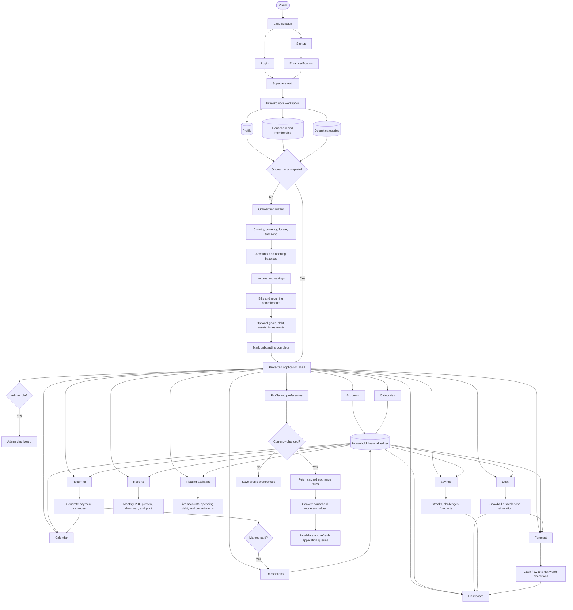
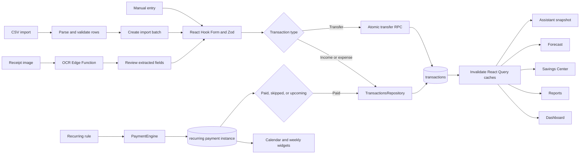
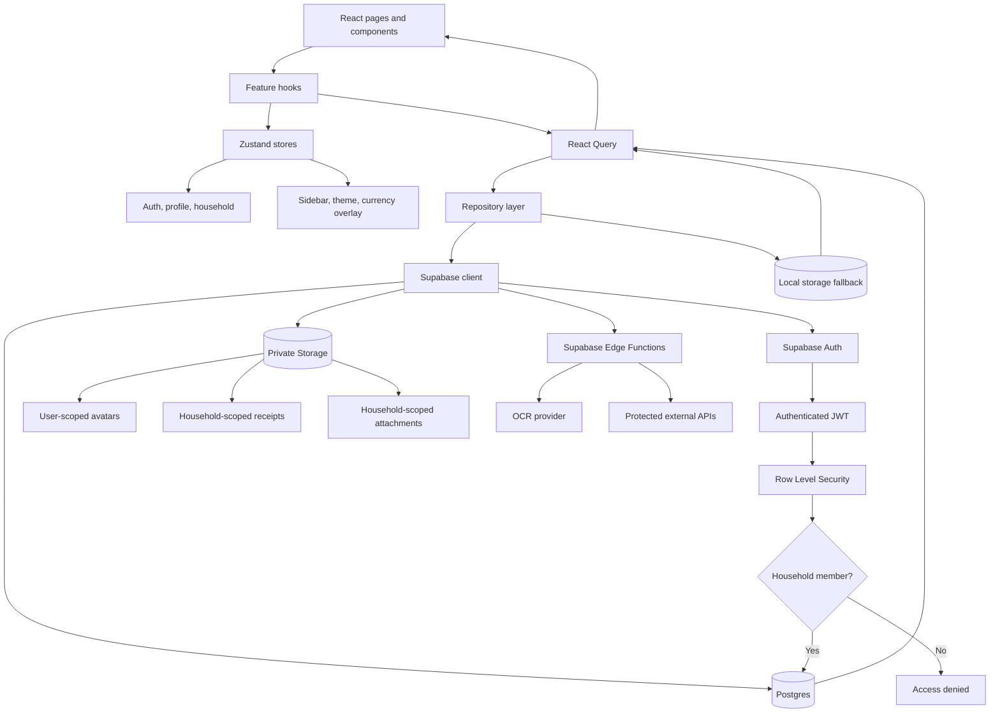
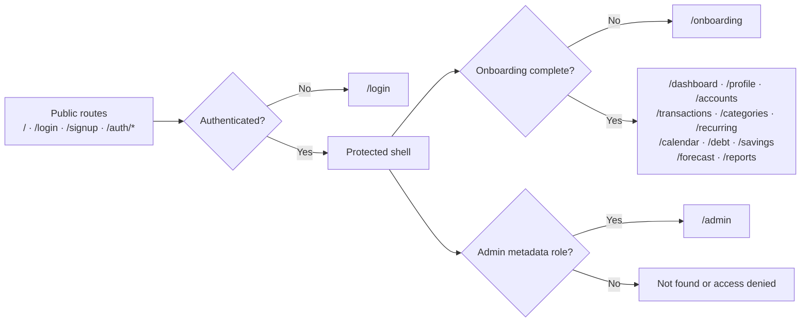

# Finlo — FinancialOS

Finlo is a personal financial operating system built with React, TypeScript, Vite, TailwindCSS, Supabase, React Query, Zustand, and PWA support.

The application is designed around a ledger-first model: transactions are the source of truth, while dashboards, calendars, reports, savings, debt, and account summaries are derived from normalized financial activity.

## Core features

- Supabase authentication with protected app routes
- Required onboarding before accessing financial modules
- Household-based financial data model
- Manual accounts with account groups, opening balances, archive/delete flows
- Investment account section inside Accounts
- Ledger-powered Transactions monthly workspace
- CSV import/export support
- Receipt OCR scanner inside Transactions
- Responsive spending-by-category charts with category filtering
- Financial calendar timeline with transactions and recurring events
- Dashboard weekly calendar with clickable day navigation
- Recurring income/bills with mark-paid workflow
- Premium Debt Center with payoff strategy simulation
- Gamified Savings Center with ledger-derived no-spend calendar
- Dashboard widgets for net worth, cash flow, debt, investments, accounts, and health
- Reports module for financial summaries
- Profile page with preferences, avatar, security actions, and currency converter
- PWA-ready build output

## Finlo application workflow

Finlo uses a household-scoped, ledger-first workflow. Authentication and onboarding establish the user workspace; accounts, categories, and transactions become the source data for the remaining financial modules.



### Transaction and recurring-payment workflow



### Data, state, and security workflow



### Route flow



### Key workflow rules

1. **The ledger is the source of truth.** Dashboard, reports, savings, calendar, debt context, and forecasts derive their values from accounts, transactions, categories, and recurring instances.
2. **The household is the security boundary.** Household-owned rows are protected through Supabase Row Level Security.
3. **Repositories own data access.** React components call repositories through feature hooks rather than querying Supabase directly.
4. **Mutations refresh dependent modules.** Transaction, recurring, debt, profile, and currency updates invalidate the relevant React Query caches.
5. **Sensitive provider calls remain server-side.** OCR and future AI/provider integrations use Supabase Edge Functions so secret keys are never included in browser bundles.
6. **Fallback persistence is temporary resilience.** Local storage supports selected demo/offline workflows, while Postgres remains the intended authoritative store.

## Tech stack

- React 19
- TypeScript
- Vite
- TailwindCSS
- React Router
- React Query
- Zustand
- React Hook Form + Zod
- Supabase Auth, Database, and Storage
- Recharts
- Lucide icons
- Vite PWA

## Getting started

Install dependencies:

```bash
npm install
```

Create your environment file:

```bash
cp .env.example .env
```

Then add your Supabase values:

```env
VITE_SUPABASE_URL=your_supabase_project_url
VITE_SUPABASE_ANON_KEY=your_supabase_anon_key
```

Start the local dev server:

```bash
npm run dev
```

Run TypeScript validation:

```bash
npx tsc --noEmit
```

Build for production:

```bash
npm run build
```

Preview the production build:

```bash
npm run preview
```

## Supabase setup

Apply migrations in order from the `supabase/migrations` directory.

The schema includes:

- profiles
- households
- household_members
- accounts
- categories
- transactions
- recurring rules and payment instances
- debt foundations
- savings foundations
- assets/liabilities foundations
- storage/security helpers

Row Level Security is expected to remain enabled. Users should only access data belonging to their household.

## Deploying to Vercel

This repository is Vercel-ready as a Vite single-page app. The included `vercel.json` configures:

- install command: `npm ci --include=dev`
- build command: `npm run build:vercel`
- Vercel Build Output directory: `.vercel/output`
- React Router SPA fallback to `index.html`
- no-cache headers for the generated service worker

The `build` script calls TypeScript and Vite through `node ./node_modules/...` instead of relying on `.bin` shims. This avoids Linux executable-bit issues such as `/node_modules/.bin/tsc: Permission denied` during Vercel builds.

The `build:vercel` script runs the normal Vite build, then copies `dist` into `.vercel/output/static` with a Vercel `config.json`. This avoids Vercel packaging errors where the build logs show `dist/...` files but the final output-directory detector still reports `No Output Directory named "dist" found`.

### 1. Push the repo to GitHub

Commit your latest changes, then push the repository to GitHub/GitLab/Bitbucket.

### 2. Import the project in Vercel

In Vercel:

1. Click **Add New → Project**.
2. Import the Finlo repository.
3. Use these settings:
   - Framework Preset: **Other**
   - Build Command: `npm run build:vercel`
   - Output Directory: leave empty / use Build Output API
   - Install Command: `npm ci --include=dev`

If Vercel auto-detects these from `vercel.json`, keep the detected values.

Use `npm ci --include=dev` on Vercel rather than `npm install`; the production build runs TypeScript, so dev dependencies must be installed and the lockfile should be respected exactly.

### 3. Add Vercel environment variables

In **Project Settings → Environment Variables**, add these for Production, Preview, and Development:

```env
VITE_SUPABASE_URL=https://your-project.supabase.co
VITE_SUPABASE_ANON_KEY=your-supabase-anon-or-publishable-key
VITE_APP_URL=https://your-vercel-domain.vercel.app
```

Optional aliases are supported, but the `VITE_*` variables above are preferred.

Do not add private provider keys, service-role keys, or OpenAI keys as `VITE_*` variables. Browser-exposed Vite variables are public.

### 4. Configure Supabase Auth redirects

In Supabase Dashboard → **Authentication → URL Configuration**:

Set **Site URL** to:

```text
https://your-vercel-domain.vercel.app
```

Add these redirect URLs:

```text
https://your-vercel-domain.vercel.app/auth/email-verified
https://your-vercel-domain.vercel.app/reset-password
http://localhost:5173/auth/email-verified
http://localhost:5173/reset-password
```

If you connect a custom domain later, add the same custom-domain callback URLs too.

### 5. Apply Supabase migrations

Before using the deployed app, make sure the remote Supabase database has all migrations applied from:

```text
supabase/migrations
```

The admin dashboard requires `0011_admin_dashboard.sql`.

### 6. Deploy

Click **Deploy** in Vercel.

After deployment, test:

- `/`
- `/login`
- `/signup`
- `/dashboard`
- `/transactions`
- `/profile`
- refresh on a protected route
- signup email verification
- password reset

### 7. Admin dashboard access

The admin dashboard is available at:

```text
/admin
```

Admin access is based on Supabase Auth user app metadata. Set one of these on the admin user:

```json
{
  "role": "admin"
}
```

or:

```json
{
  "roles": ["admin"]
}
```

`super_admin` is also supported.

## Development notes

- Do not store duplicated financial totals.
- Use repositories for Supabase access; avoid direct Supabase queries inside UI components.
- Keep calculations in shared engines/selectors/repository models where possible.
- Dashboard, reports, savings, debt, and calendar should derive from transactions and recurring instances.
- Secrets must not be placed in `VITE_*` variables.
- Any future AI/OpenAI calls should run through a server or Supabase Edge Function.
