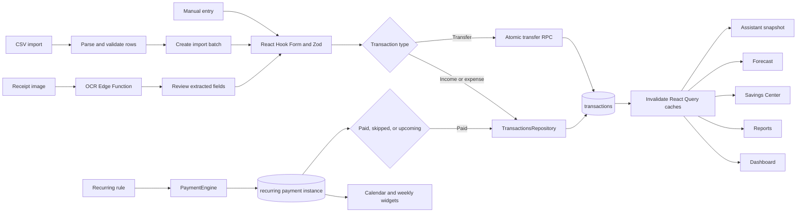
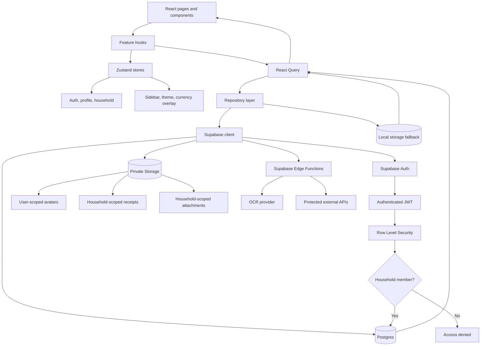
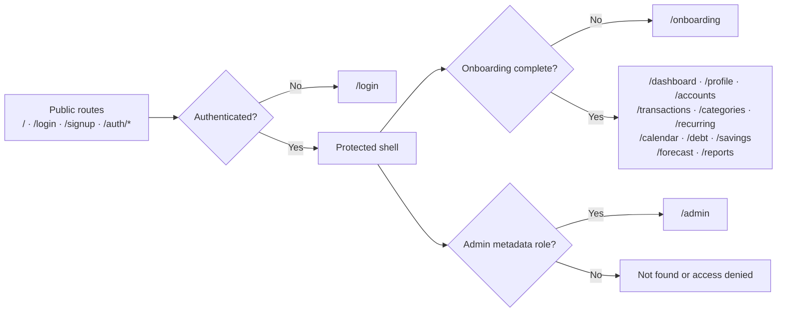

# Finlo - Ultimate Finance Manager 

<p align="center">

<a href="https://devpost.com/software/finlo" target="_blank">
  
</a>


</p>

---

> **A modern Personal Financial Operating System built to replace spreadsheets and disconnected finance apps with one intelligent workspace.**

Finlo is built with **React, TypeScript, Vite, Tailwind CSS, Supabase, React Query, Zustand, and Progressive Web App (PWA)** technologies.

Unlike traditional budgeting apps, Finlo follows a **ledger-first architecture**, where every financial transaction becomes the single source of truth. Dashboards, budgets, investments, debt management, forecasting, recurring bills, reports, net worth, and AI-powered insights are all derived from this unified financial ledger, ensuring consistency across the entire platform.

The vision is simple:

> **One application. One financial ledger. Complete control over your financial life.**


## Why Finlo?

The idea for Finlo came from a simple observation: most people don't use just one tool to manage their finances. They often have a budgeting app, a spreadsheet for expenses, another sheet for debt repayment, an investment tracker, and a calendar for bills. Managing money ends up meaning managing multiple tools.

While researching this space, I found that this isn't just a personal frustration—it's a growing market with plenty of room for innovation. According to **Fortune Business Insights**, the global **Personal Finance Software Market** was valued at around **USD 1.35 billion in 2025** and is expected to grow to **USD 2.57 billion by 2034**, driven by increasing adoption of digital financial tools, mobile applications, and AI-powered financial planning.

At the same time, user expectations are changing. People are no longer looking for apps that only track expenses. They want a complete picture of their financial life—budgets, savings, debt, investments, forecasting, recurring bills, and personalized insights—all in one place. AI is also becoming an important part of personal finance, helping users understand their spending habits, plan ahead, and make more informed decisions.

Today's leading products such as **YNAB**, **Monarch Money**, **Copilot Money**, **Rocket Money**, **Quicken Simplifi**, **Empower**, and **PocketSmith** each do an excellent job in specific areas. However, many users still end up switching between multiple apps or maintaining spreadsheets because no single platform covers everything seamlessly.

That's the gap Finlo aims to fill.

Instead of focusing on just budgeting or expense tracking, Finlo brings together budgeting, debt management, investments, net worth, forecasting, recurring payments, financial goals, OCR receipt scanning, and an AI-powered financial assistant into one connected workspace. The goal isn't to replace a single app—it's to replace the collection of tools people use to manage their finances.

---

## Core features

- Supabase authentication with protected app routes
- Required onboarding before accessing financial modules
- Household-based financial data model
- Manual accounts with account groups, opening balances, archive/delete flows
- Investment account section inside Accounts
- Ledger-powered Transactions monthly workspace
- CSV import/export support
- Receipt OCR scanner inside Transactions
- Responsive spending-by-category charts with category filtering
- Financial calendar timeline with transactions and recurring events
- Dashboard weekly calendar with clickable day navigation
- Recurring income/bills with mark-paid workflow
- Premium Debt Center with payoff strategy simulation
- Gamified Savings Center with ledger-derived no-spend calendar
- Dashboard widgets for net worth, cash flow, debt, investments, accounts, and health
- Reports module for financial summaries
- Profile page with preferences, avatar, security actions, and currency converter
- PWA-ready build output

---

## Getting started

Install dependencies:

```bash
npm install
```

Create your environment file:

```bash
cp .env.example .env
```

Then add your Supabase values:

```env
VITE_SUPABASE_URL=your_supabase_project_url
VITE_SUPABASE_ANON_KEY=your_supabase_anon_key
```

Start the local dev server:

```bash
npm run dev
```

Run TypeScript validation:

```bash
npx tsc --noEmit
```

Build for production:

```bash
npm run build
```

Preview the production build:

```bash
npm run preview
```

---

## Finlo application workflow

Finlo uses a household-scoped, ledger-first workflow. Authentication and onboarding establish the user workspace; accounts, categories, and transactions become the source data for the remaining financial modules.


### Transaction and recurring-payment workflow



### Data, state, and security workflow



### Route flow



### Key workflow rules

1. **The ledger is the source of truth.** Dashboard, reports, savings, calendar, debt context, and forecasts derive their values from accounts, transactions, categories, and recurring instances.
2. **The household is the security boundary.** Household-owned rows are protected through Supabase Row Level Security.
3. **Repositories own data access.** React components call repositories through feature hooks rather than querying Supabase directly.
4. **Mutations refresh dependent modules.** Transaction, recurring, debt, profile, and currency updates invalidate the relevant React Query caches.
5. **Sensitive provider calls remain server-side.** OCR and future AI/provider integrations use Supabase Edge Functions so secret keys are never included in browser bundles.
6. **Fallback persistence is temporary resilience.** Local storage supports selected demo/offline workflows, while Postgres remains the intended authoritative store.

<<<<<<< HEAD
# 🛠️ Tech Stack
=======
# Tech Stack
>>>>>>> 882472fd6502f29a0d3af2a63d3c61b44e10fcd0


---

# Topics

`personal-finance` `budgeting` `expense-tracker` `financial-planning`
`money-management` `forecasting` `investments`
`debt-management` `net-worth`
`react` `typescript` `vite`
`supabase` `tailwindcss`
`pwa` `openai`
`rag`
`ocr`
`dashboard`
`analytics`

---

# References

- **Fortune Business Insights** — Personal Finance Software Market  
  https://www.fortunebusinessinsights.com/personal-finance-software-market-112683

- **Research and Markets** — Personal Finance App Market  
  https://www.researchandmarkets.com/report/personal-finance-app-market

- **Deloitte Insights** — Financial Services Industry Trends  
  https://www2.deloitte.com/global/en/insights/industry/financial-services.html

- **OpenAI** — GPT-5.6 & Codex Documentation  
  https://platform.openai.com/docs

- **Supabase Documentation**  
  https://supabase.com/docs

- **React Documentation**  
  https://react.dev

- **Vite Documentation**  
  https://vite.dev

- **Tailwind CSS Documentation**  
<<<<<<< HEAD
  https://tailwindcss.com/docs
=======
  https://tailwindcss.com/docs
>>>>>>> 882472fd6502f29a0d3af2a63d3c61b44e10fcd0
