# Finlo User Manual

**Version 1.0 · July 2026**

---

## Table of Contents

1. [Introduction](#1-introduction)
2. [System Requirements](#2-system-requirements)
3. [Application Overview](#3-application-overview)
   - [Architecture Overview](#architecture-overview)
   - [DFD Level 0](#dfd-level-0)
   - [DFD Level 1](#dfd-level-1)
   - [DFD Level 2](#dfd-level-2)
4. [Application Workflow](#4-application-workflow)
5. [Feature Walkthrough](#5-feature-walkthrough)
   - [5.1 Recurring Payments](#51-recurring-payments)
   - [5.2 Dashboard](#52-dashboard)
   - [5.3 Financial Calendar](#53-financial-calendar)
   - [5.4 Profile — Security](#54-profile--security)
   - [5.5 Profile — Security (Detailed View)](#55-profile--security-detailed-view)
   - [5.6 Sidebar, Goals & Notifications](#56-sidebar-goals--notifications)
6. [End-to-End User Workflows](#6-end-to-end-user-workflows)
7. [Dashboard Explanation](#7-dashboard-explanation)
8. [AI Assistant](#8-ai-assistant)
9. [Reports](#9-reports)
10. [Notifications](#10-notifications)
11. [Profile](#11-profile)
12. [Frequently Asked Questions](#12-frequently-asked-questions)
13. [Troubleshooting](#13-troubleshooting)
14. [Financial Glossary](#14-financial-glossary)
15. [Best Practices](#15-best-practices)

---

## 1. Introduction

### Purpose of Finlo

Finlo is a **Personal Financial Operating System** — one place to plan, track, and grow your money. Instead of juggling spreadsheets, budgeting apps, debt trackers, and investment sheets, Finlo connects everything through a single financial ledger. When you record a transaction, update a budget, or mark a bill as paid, the rest of the app reflects that change automatically.

### Intended Users

Finlo is built for:

- Individuals and households who want a clear picture of cash flow, debt, savings, and net worth
- People moving away from manual spreadsheets who still want control over their data
- Users who want forecasting, recurring bill management, and optional AI guidance in one workspace

### Key Features

| Area | What Finlo offers |
|------|-------------------|
| **Ledger** | Accounts, transactions, categories, CSV import/export |
| **Planning** | Monthly budgets, SMART goals, sinking funds, debt payoff strategies |
| **Wealth** | Investments, assets, crypto, loans, credit cards, net worth timeline |
| **Automation** | Recurring income and bills, calendar, email reminders |
| **Intelligence** | Dashboard KPIs, forecasts, financial news, AI assistant (RAG) |
| **Reporting** | Monthly summaries with PDF/CSV export |

### Objectives of the Application

1. Replace disconnected tools with one consistent financial workspace
2. Keep the **transaction ledger** as the single source of truth
3. Surface actionable insights — not just raw numbers
4. Help users pay down debt, hit goals, and understand net worth over time
5. Stay accessible on desktop and mobile through a Progressive Web App (PWA)

---

## 2. System Requirements

### Desktop Browsers

Finlo runs in modern browsers. For the best experience, use a current version of:

| Browser | Minimum recommendation |
|---------|------------------------|
| Google Chrome | Latest 2 major versions |
| Microsoft Edge | Latest 2 major versions |
| Mozilla Firefox | Latest 2 major versions |
| Safari (macOS) | Latest 2 major versions |

### Mobile Browsers

Finlo is responsive and works on mobile Safari and Chrome. Touch-friendly navigation and a bottom bar appear on smaller screens.

### PWA Support

Finlo can be installed as a Progressive Web App:

- **Desktop:** Use the browser’s “Install app” or “Add to desktop” option when prompted
- **Mobile:** Use “Add to Home Screen” from the browser menu

Installed PWAs open in their own window and cache core assets for faster loading.

### Internet Requirements

| Requirement | Details |
|-------------|---------|
| **Connection** | Active internet required for login, sync, and live market/news data |
| **Supabase** | Your data is stored securely in the cloud; offline edits are not fully supported |
| **APIs** | Exchange rates, market data, and AI features need network access |

> **Note:** Finlo is designed as an online-first application. Brief disconnections may show cached data, but saving changes requires a connection.

---

## 3. Application Overview

Finlo combines everyday money management with longer-term planning. The sidebar groups features into logical areas:

| Group | Modules |
|-------|---------|
| **Home** | Dashboard |
| **Finances** | Accounts, Transactions, Categories, Monthly Budgets, Recurring |
| **Planning** | Goals, Sinking Funds, Debt, Forecast |
| **Wealth** | Investments & Net Worth |
| **Tools** | Financial News & AI, Feedback |
| **Profile** | Profile (settings, security, support) |

Additional routes (Calendar, Reports, Onboarding) are reachable from the dashboard, footer links, or search — they do not clutter the main sidebar.

### Architecture Overview

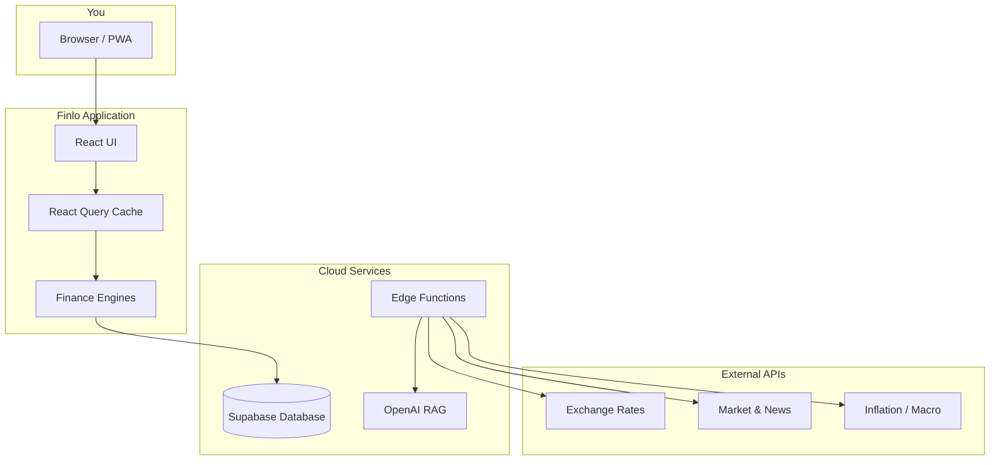

**Table 1 — High-level architecture layers**

| Layer | Role |
|-------|------|
| React UI | Screens, forms, charts, navigation |
| React Query | Caches data, reduces redundant loading |
| Finance Engines | Budget, debt, forecast, net worth calculations |
| Supabase | Authentication, database, file storage |
| Edge Functions | Secure proxy for AI, OCR, email, market data |

### DFD Level 0

Context diagram — Finlo as a single process between you and external systems.

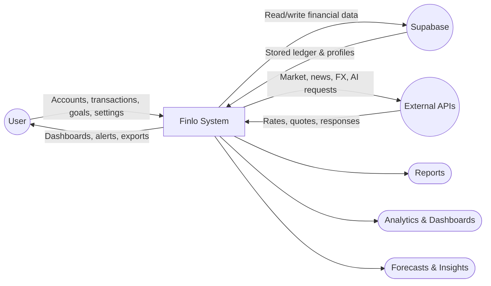

### DFD Level 1

Major modules and how data flows between them.

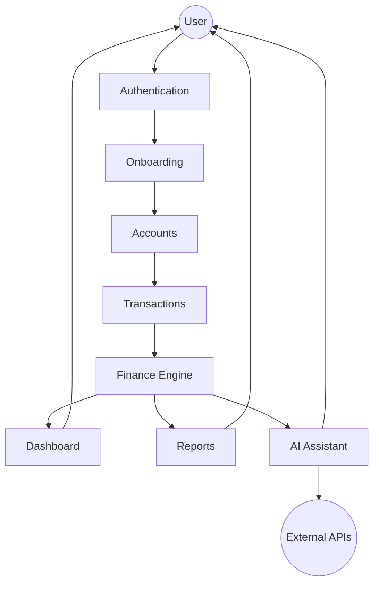

**Table 2 — Level 1 module summary**

| Module | Input | Output |
|--------|-------|--------|
| Authentication | Email, password | Session, protected routes |
| Onboarding | Household, currency, country | Unlocked financial modules |
| Accounts | Account details | Ledger starting balances |
| Transactions | Amounts, categories, dates | Updated balances, budgets |
| Finance Engine | Ledger + rules | KPIs, forecasts, debt plans |
| Dashboard | Engine output | Cards, charts, widgets |
| Reports | Monthly aggregates | PDF, CSV, charts |
| AI Assistant | Natural language questions | Answers from ledger + knowledge base |

### DFD Level 2

Transaction and Finance Engine breakdown.

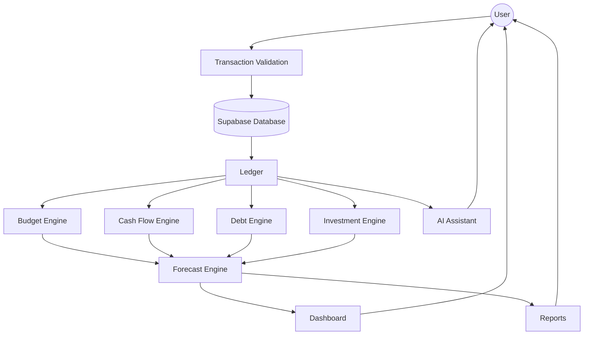

---

## 4. Application Workflow

High-level path from first visit to everyday use.

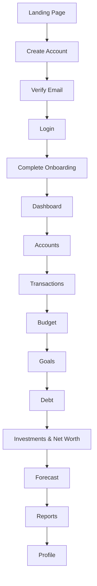

**Typical first-week path**

1. Sign up and verify your email
2. Finish onboarding (household name, currency, country)
3. Add bank accounts with opening balances
4. Import or enter recent transactions
5. Set up categories and a monthly budget
6. Add recurring bills and income
7. Review the dashboard daily; explore debt, goals, and forecast when ready

---

## 5. Feature Walkthrough

This section documents every application screenshot included with this manual. Screens without screenshots are covered in Sections 6–11.

---

### 5.1 Recurring Payments

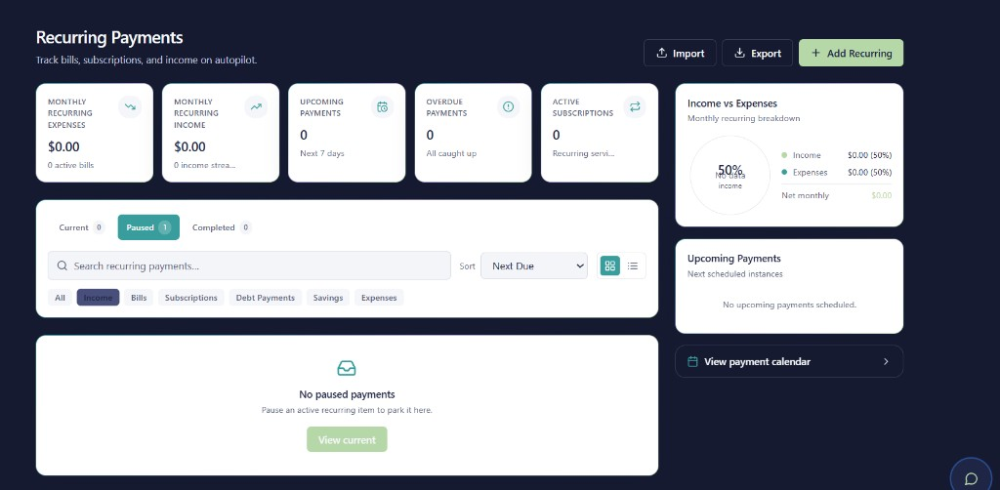

*Figure 1 — Recurring Payments: summary KPIs, filters, and upcoming payment sidebar*

#### Purpose

Track bills, subscriptions, and recurring income in one place. Finlo generates payment instances on the Recurring page, Financial Calendar, and Dashboard weekly widget.

#### Navigation

**Finances → Recurring** in the sidebar, or search for a recurring item with **⌘K / Ctrl+K**.

#### Main Components

| Component | Description |
|-----------|-------------|
| Summary cards | Monthly expenses, income, upcoming (7 days), overdue, active subscriptions |
| Status tabs | Current, Paused, Completed |
| Search & sort | Filter by name; sort by next due date |
| Category chips | All, Income, Bills, Subscriptions, Debt Payments, Savings, Expenses |
| Income vs Expenses | Donut chart and net monthly figure |
| Upcoming list | Next scheduled instances |
| Calendar link | Opens the full Financial Calendar |

#### Important KPIs

- **Monthly Recurring Expenses** — total of active bill/subscription rules
- **Monthly Recurring Income** — salary, rent received, etc.
- **Upcoming / Overdue** — what needs attention this week

#### How to Use

1. Click **+ Add Recurring** (top right).
2. Choose type: income, bill, subscription, or transfer.
3. Set amount, account, frequency, and next due date.
4. Save — instances appear on Recurring, Calendar, and Dashboard.
5. When paid in real life, click **Mark Paid** to post a ledger transaction (no duplicate if already marked).

#### Tips

- Pause seasonal items instead of deleting them.
- Use **Import / Export** for bulk setup from CSV.
- Assign an account to every rule so “Mark Paid” works correctly.

#### Best Practices

- Review upcoming payments every Monday.
- Match subscription names to your bank statement descriptions.
- Keep paused items in the Paused tab for reference.

#### Common Mistakes

- Creating a recurring rule without linking an account
- Marking paid twice for the same instance
- Forgetting to pause cancelled subscriptions

#### Related Screens

Financial Calendar (Figure 3), Dashboard weekly payments widget, Transactions

---

### 5.2 Dashboard

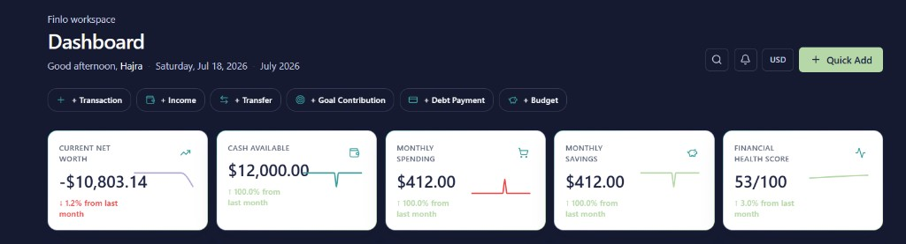

*Figure 2 — Dashboard: greeting, quick actions, and top-level KPI cards*

#### Purpose

Your financial command center. The dashboard aggregates net worth, cash, spending, savings, and health score from live ledger data.

#### Navigation

**Home → Dashboard** (default after login and onboarding).

#### Main Components

| Component | Description |
|-----------|-------------|
| Header | Greeting, date, month label, search, notifications, currency |
| Quick actions | + Transaction, Income, Transfer, Goal Contribution, Debt Payment, Budget |
| Hero KPI cards | Net worth, cash, spending, savings, health score (with sparklines) |
| Financial Health | Score breakdown with “View more” modal |
| Charts | Cash flow, categories, net worth range |
| Widgets | Weekly payments, mini calendar, debt, investments, goals, budget |
| Footer links | Reports, calendar, insights |

#### Important KPIs

| KPI | Meaning |
|-----|---------|
| Current Net Worth | Assets minus liabilities |
| Cash Available | Liquid balances across bank accounts |
| Monthly Spending | Expenses in the current month |
| Monthly Savings | Income minus expenses (when positive) |
| Financial Health Score | Composite 0–100 score |

#### How to Use

1. Open Finlo after login — you land here automatically.
2. Scan the top cards for a 30-second health check.
3. Use quick actions to add data without leaving the page.
4. Scroll for charts, upcoming bills, and recent transactions.
5. Click any widget title to jump to the full module.

#### Tips

- Red downward arrows on net worth are normal after large purchases or new debt.
- Use **View more** on Financial Health to see which areas to improve.
- The weekly payments strip links directly to mark-paid actions.

#### Best Practices

- Check the dashboard at least twice a week.
- Record transactions within 24 hours for accurate monthly figures.
- Use quick actions instead of navigating manually when adding one item.

#### Common Mistakes

- Ignoring overdue recurring items shown in widgets
- Expecting investment gains on the dashboard before holdings are entered in Wealth Center

#### Related Screens

All modules; Reports via footer; Recurring and Calendar via payment widgets

---

### 5.3 Financial Calendar

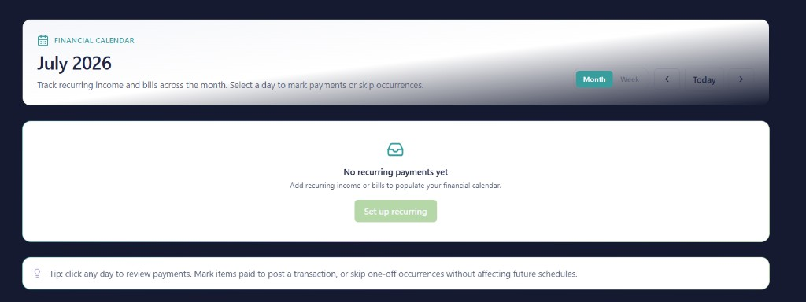

*Figure 3 — Financial Calendar: month view with setup prompt*

#### Purpose

See recurring income and bills laid out on a calendar. Select any day to mark payments paid, skip one occurrence, or review what’s due.

#### Navigation

Dashboard **Mini Calendar** widget, Recurring page **View payment calendar**, or route `/calendar`.

#### Main Components

| Component | Description |
|-----------|-------------|
| Month / Week toggle | Switch calendar granularity |
| Navigation arrows | Previous / next period |
| Today button | Jump to current date |
| Day cells | Color-coded recurring instances |
| Day drawer | Actions for selected day |
| Tip bar | Mark paid vs skip guidance |

#### Important KPIs

Calendar itself shows **counts and amounts per day**, not aggregate KPIs. Summary KPIs live on Recurring and Dashboard.

#### How to Use

1. Set up recurring rules first (Figure 1).
2. Open the calendar — days with items show indicators.
3. Click a day to open the detail drawer.
4. **Mark Paid** posts a transaction; **Skip** removes only that occurrence.
5. Switch to **Week** view for a tighter near-term view.

#### Tips

- Empty calendar? Click **Set up recurring** to go straight to Recurring.
- Skipping is useful for one-off delays (e.g., bill postponed a week).
- Mark Paid requires the recurring rule to have an account assigned.

#### Best Practices

- Use Month view for planning; Week view for execution.
- Align calendar review with your pay cycle.

#### Common Mistakes

- Expecting manual transactions to appear (calendar shows **recurring instances** only)
- Skipping when you actually paid (use Mark Paid instead)

#### Related Screens

Recurring Payments, Transactions, Dashboard weekly widget

---

### 5.4 Profile — Security

*Figure 4 — Profile: password change and reset options*

#### Purpose

Manage account security — change your password or request a reset email.

#### Navigation

**Profile → Security** tab in the profile tab bar.

#### Main Components

| Field / Control | Description |
|-----------------|-------------|
| Current Password | Verify existing credential |
| New Password | Must meet strength rules |
| Confirm Password | Must match new password |
| Change Password | Saves new credential |
| Reset Password Email | Sends Supabase reset link |

#### Password Requirements

- At least 8 characters
- One uppercase letter
- One lowercase letter
- One number
- One special character

#### How to Use

1. Go to **Profile** in the sidebar.
2. Select the **Security** tab.
3. Enter current and new passwords.
4. Watch the checklist turn green as requirements are met.
5. Click **Change Password**.

For a forgotten password while logged out, use **Forgot Password** on the login screen.

#### Tips

- Use **Reset Password Email** if you prefer clicking a link in your inbox.
- Password fields support show/hide via the eye icon.

#### Best Practices

- Change passwords after sharing a device or suspected breach.
- Do not reuse banking passwords for Finlo.

#### Common Mistakes

- Mismatch between New and Confirm fields
- Weak passwords that fail the checklist silently until submit

#### Related Screens

Login, Forgot Password, Profile → Personal Information

---

### 5.5 Profile — Security (Detailed View)

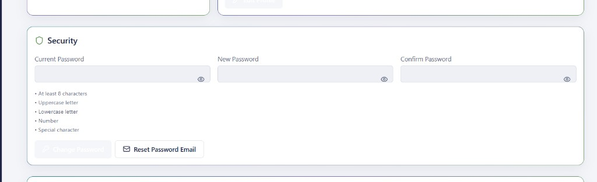

*Figure 5 — Profile Security: same module, full-width layout capture*

This screenshot shows the same **Security** tab as Figure 4 from a slightly different viewport. All instructions in [Section 5.4](#54-profile--security) apply identically.

Use this view when:

- Reviewing password rules before typing
- Confirming the **Reset Password Email** option is available
- Documenting accessibility of show/hide toggles on each field

---

### 5.6 Sidebar, Goals & Notifications

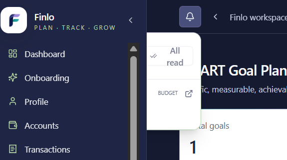

*Figure 6 — Sidebar, SMART Goal Planner header, and notification panel*

#### Purpose

Shows three connected areas: primary navigation, goal planning entry point, and in-app notifications.

#### Navigation

- **Sidebar:** persistent left panel (collapsible with ‹ › control)
- **Goals:** Planning → Goals
- **Notifications:** bell icon in top bar

#### Main Components

| Component | Description |
|-----------|-------------|
| Finlo logo & tagline | Brand; “Plan · Track · Grow” |
| Sidebar groups | Home, Finances, Planning, Wealth, Tools, Profile |
| SMART Goal Planner | Goal list with total count KPI |
| Notification bell | Opens dropdown with unread items |
| Mark all read | Clears notification badges |

#### Important KPIs

- **Total goals** on Goals page
- **Unread notification count** on bell badge
- Budget alerts shown in notification dropdown (example: “BUDGET” entry)

#### How to Use — Goals

1. Open **Planning → Goals**.
2. Click **+ Add Goal** (or equivalent action button).
3. Fill SMART fields: name, type, target amount, date, priority.
4. Link a funding account if desired.
5. Track progress on the Goals page and Dashboard widget.

#### How to Use — Notifications

1. Click the **bell** icon when a badge appears.
2. Read budget, bill, or goal alerts.
3. Click a notification to jump to the related screen.
4. Use **Mark all read** when caught up.

#### Tips

- Collapse the sidebar on smaller laptops for more chart space.
- Goal milestones also surface on the Dashboard Goals widget.

#### Best Practices

- Act on budget notifications within 48 hours.
- Keep goal targets realistic; update monthly contributions when income changes.

#### Common Mistakes

- Creating duplicate goals for the same purpose
- Dismissing notifications without reading overspend warnings

#### Related Screens

Dashboard Goals widget, Monthly Budgets, Profile notifications tab

---

## 6. End-to-End User Workflows

### 6.1 Account Setup

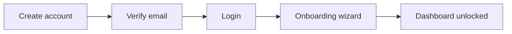

1. Visit the Finlo landing page → **Sign up**
2. Check email → click verification link
3. Log in → complete onboarding (household, currency, timezone)
4. Land on Dashboard with sidebar unlocked

### 6.2 Adding a Bank Account

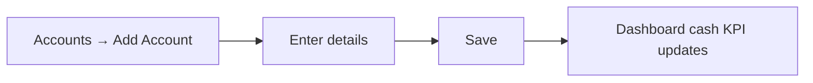

1. **Finances → Accounts**
2. **Add Account** → name, type (checking/savings/wallet), institution, opening balance
3. Save — cash available on Dashboard reflects the new balance

### 6.3 Recording an Expense

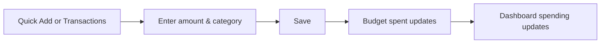

1. Dashboard **+ Transaction** or **Transactions** page
2. Type: Expense; pick account, category, date, merchant
3. Save — budget progress and monthly spending refresh automatically

### 6.4 Creating a Monthly Budget

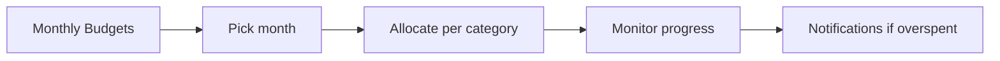

1. **Finances → Monthly Budgets**
2. Select month/year
3. Set allocation per category (or use suggestions)
4. Watch spent vs allocated bars; fix overspends early

### 6.5 Paying Down Debt

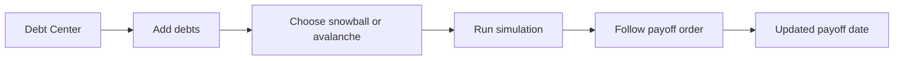

1. **Planning → Debt**
2. Enter balances, APR, minimum payments
3. Compare **Snowball** vs **Avalanche** strategies
4. Apply extra payments as planned; log payments via Transactions

### 6.6 Tracking Investments & Net Worth

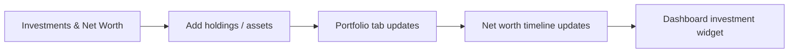

1. **Wealth → Investments & Net Worth**
2. Use tabs: Investments, Assets, Crypto, Loans, Credit Cards
3. Enter quantities and values — no duplicate account entries
4. Review Overview and Net Worth tabs for timeline charts

---

## 7. Dashboard Explanation

| Card / Widget | What it shows | Where to drill down |
|---------------|---------------|---------------------|
| **Financial Health** | 0–100 score + breakdown (budget, savings, debt, investments, emergency, cash flow) | View more modal |
| **Net Worth** | Assets − liabilities with trend sparkline | Investments & Net Worth |
| **Income / Expenses** | Current month totals | Transactions, Monthly Snapshot |
| **Cash Flow** | Historical in vs out chart | Transactions, Forecast |
| **Budget** | Category progress vs allocation | Monthly Budgets |
| **Goals** | Active goals and progress % | Goals |
| **Debt** | Total balance, strategy hint | Debt Center |
| **Forecast** | Projected net worth snippet | Forecast |
| **Notifications** | Bell icon — budget, bills, goals | Notification center |
| **Weekly Payments** | Next 7 days recurring items | Recurring, Calendar |
| **Mini Calendar** | Month grid with due indicators | Financial Calendar |
| **Charts** | Cash flow, categories, net worth ranges | Full-screen modules |
| **Recent Transactions** | Latest ledger entries | Transactions |
| **Accounts Summary** | Balances by account group | Accounts |

> **Tip:** Hero cards at the top are your daily snapshot. Widgets below are for weekly planning.

---

## 8. AI Assistant

Finlo includes AI in two places:

1. **Floating chatbot** — bottom-right on most screens
2. **Financial News & AI** page — embedded “Ask Finlo AI” widget plus news

### Purpose

Answer questions about **your Finlo data** and **general financial concepts** using a retrieval-augmented (RAG) knowledge base — not generic guessing.

### Example Questions

- “How much did I spend on food this month?”
- “What’s my total debt?”
- “Explain debt snowball vs avalanche.”
- “What is an emergency fund?”
- “When is my next recurring bill due?”

### Supported Topics

| Topic | Examples |
|-------|----------|
| **Your data** | Balances, spending, income, upcoming bills |
| **Budgeting** | Categories, overspend, savings rate |
| **Debt** | Snowball, avalanche, payoff order |
| **Investments** | Holdings, net worth, diversification (high level) |
| **Forecasting** | How projections work, scenarios |
| **Terminology** | Definitions from Finlo knowledge base |

### RAG Knowledge Base

Finlo ships with curated content (`docs/financial-knowledge.md`) embedded for semantic search. When the assistant cannot find an answer in your data or the knowledge base, it says so and may suggest submitting **Feedback**.

> **Warning:** AI responses are educational, not licensed financial advice. Verify important decisions independently.

---

## 9. Reports

Access via Dashboard footer or route `/reports`.

### Report Contents

| Element | Description |
|---------|-------------|
| Month picker | Select year and month |
| Income / expense summary | Totals for the period |
| Category breakdown | Where money went |
| Charts | Visual trends |
| KPIs | Net, savings rate, top categories |

### Filtering

- Choose **year** then **month**
- Currency follows household default

### Exporting

- **PDF** — formatted summary for printing or sharing
- **CSV** — raw figures for spreadsheets

> **Note:** Reports derive from the ledger. Incomplete transaction history produces incomplete reports.

---

## 10. Notifications

Open the **bell icon** in the top bar.

| Type | When it appears |
|------|-----------------|
| **Budget alerts** | Category approaching or exceeding allocation |
| **Upcoming bills** | Recurring payment due soon |
| **Goals** | Milestone reached or behind schedule |
| **Debt reminders** | Payment due or simulation milestone |
| **Investment updates** | Significant portfolio moves (when configured) |

**Mark all read** clears the badge. Email reminders for bills may be configured via Supabase scheduled functions (see README for cron setup).

---

## 11. Profile

Profile consolidates identity, preferences, security, and support.

| Tab | Actions |
|-----|---------|
| **Personal Information** | Name, avatar, email (read-only) |
| **Security** | Change password, reset email (Figures 4–5) |
| **Preferences** | Country, timezone, language |
| **Currency** | Display currency; converts all amounts app-wide |
| **Notifications** | Overview of in-app alert types |
| **Theme** | Light, dark, or system |
| **Connected Services** | Placeholder for future bank/broker links |
| **Privacy** | Data protection summary |
| **Support** | FAQ, documentation references, contact, feedback link |
| **Delete Account** | Confirmation flow (requires password) |

### Currency Converter

Available on Profile — live rates for reference when planning in another currency.

---

## 12. Frequently Asked Questions

1. **Do I need to complete onboarding?** Yes. Financial modules stay locked until onboarding finishes.

2. **Can multiple people share one household?** Finlo uses a household model; all members see the same ledger (future roles may expand).

3. **What’s the difference between Accounts and Wealth Center?** Accounts hold **bank/cash** balances. Investments, property, crypto, loans, and cards live in **Investments & Net Worth**.

4. **How is net worth calculated?** Assets (cash, investments, property, etc.) minus liabilities (loans, credit card balances, debts).

5. **Why is my net worth negative?** Common when loans exceed liquid assets — add all debts for an accurate picture.

6. **How do I import transactions?** Transactions page → Import CSV (match column format in app help).

7. **Can I export my data?** Yes — CSV from Transactions; PDF/CSV from Reports.

8. **What is Mark Paid on recurring items?** Posts a real transaction and marks the instance paid without duplicating.

9. **What happens if I skip a calendar occurrence?** Only that date is skipped; future instances continue.

10. **Snowball or avalanche — which should I use?** Snowball for motivation (smallest balance first); avalanche for less interest (highest APR first).

11. **How often does the dashboard refresh?** Automatically when data changes; manual browser refresh also reloads from server.

12. **Does Finlo connect to my bank automatically?** Not yet — accounts are manual or CSV import. Connected Services is planned.

13. **What currencies are supported?** Major ISO codes (USD, EUR, GBP, INR, etc.). Changing currency converts stored amounts.

14. **Is my data secure?** Supabase Row Level Security scopes data to your household; passwords are hashed.

15. **Can I use Finlo offline?** Limited — PWA caches the shell, but sync requires internet.

16. **How do I install the PWA?** Browser menu → Install app / Add to Home Screen.

17. **What is the Financial Health Score?** A 0–100 composite of budget discipline, savings, debt load, investments, emergency fund, and cash flow.

18. **Where is the AI assistant?** Floating button (bottom-right) and Financial News & AI page.

19. **Can the AI move money?** No — it read-only answers questions and explains concepts.

20. **How do SMART goals work?** Specific, measurable targets with optional dates, priorities, and linked accounts.

21. **What are Sinking Funds?** Dedicated savings pots for planned future expenses (Savings page).

22. **How far does Forecast project?** Typically 6–24 months depending on settings and data quality.

23. **Why are budget notifications firing?** You exceeded or neared a category allocation — review Monthly Budgets.

24. **Can I delete a transaction?** Yes — Transactions list → delete (soft-delete preserves audit trail depending on settings).

25. **How do I archive an account?** Accounts → Archive — hides without deleting history.

26. **Where did Financial Health page go?** It’s a Dashboard widget with “View more” — not a separate page.

27. **Where is Settings?** Merged into **Profile** tabs.

28. **How do I submit feedback?** Tools → Feedback, or Support tab in Profile.

29. **Who sees admin screens?** Users with admin flag in app metadata only.

30. **How do I get help?** Profile → Support tab, floating AI assistant, or email support contact listed there.

---

## 13. Troubleshooting

### Login Issues

| Problem | Solution |
|---------|----------|
| Wrong password | Use **Forgot Password** on login screen |
| Email not verified | Check spam; resend from verify-email page |
| Blank screen after login | Clear cache; ensure Supabase URL/key in environment (self-hosted) |

### Email Verification

- Links expire — use **Resend verification** if prompted
- Must verify before full access in some configurations

### Forecast Errors

- Add at least 2–3 months of transaction history
- Ensure accounts have correct opening balances
- Check Debt Center entries for APR and minimums

### Synchronization Issues

- Confirm internet connection
- Log out and back in
- Hard refresh: Ctrl+Shift+R (Windows) or Cmd+Shift+R (Mac)

### PWA Installation

| Platform | Steps |
|----------|-------|
| Chrome desktop | Address bar → Install icon |
| iOS Safari | Share → Add to Home Screen |
| Android Chrome | Menu → Install app |

### Offline Mode

Finlo expects connectivity for writes. If offline, note transactions elsewhere and enter when back online.

---

## 14. Financial Glossary

| Term | Definition |
|------|------------|
| **401(k)** | US employer-sponsored retirement plan (pre-tax contributions). |
| **Amortization** | Paying off debt in fixed installments over time. |
| **APR** | Annual Percentage Rate — yearly cost of borrowing including fees. |
| **APY** | Annual Percentage Yield — effective return including compounding. |
| **Asset** | Something you own with monetary value (cash, property, stocks). |
| **Asset Allocation** | How investments are divided among stocks, bonds, cash, etc. |
| **Balance** | Amount in an account at a point in time. |
| **Bond** | Loan to a government or company paying interest. |
| **Budget** | Plan for income and spending over a period. |
| **Capital Gain** | Profit from selling an asset above purchase price. |
| **Cash Flow** | Money moving in and out over a period. |
| **Cash Flow Positive** | More income than expenses in a period. |
| **Category** | Label grouping transactions (e.g., Groceries, Rent). |
| **CAGR** | Compound Annual Growth Rate — smoothed yearly return. |
| **Checking Account** | Bank account for daily spending and deposits. |
| **Collateral** | Asset pledged against a loan (e.g., house for mortgage). |
| **Compound Interest** | Interest earned on principal plus prior interest. |
| **Credit Limit** | Maximum you can borrow on a credit card. |
| **Credit Score** | Numerical creditworthiness rating (external to Finlo). |
| **Crypto** | Digital assets like Bitcoin tracked in Wealth Center. |
| **Debt Avalanche** | Pay highest APR debt first to minimize interest. |
| **Debt Snowball** | Pay smallest balance first for psychological wins. |
| **Debt-to-Income (DTI)** | Monthly debt payments divided by gross income. |
| **Diversification** | Spreading investments to reduce risk. |
| **Dividend** | Company payout to shareholders from profits. |
| **Emergency Fund** | Cash reserved for unexpected expenses (3–6 months expenses). |
| **Equity** | Ownership value (e.g., home value minus mortgage). |
| **ETF** | Exchange-Traded Fund — basket of assets traded like a stock. |
| **Expense** | Money spent; recorded as outflow in Finlo. |
| **Financial Health Score** | Finlo composite 0–100 wellness indicator. |
| **Fixed Expense** | Cost that stays similar each month (rent, subscription). |
| **Forecast** | Projection of future balances based on trends and rules. |
| **Gold ETF** | Fund tracking gold prices without holding physical gold. |
| **Gross Income** | Total income before taxes and deductions. |
| **Household** | Finlo workspace grouping accounts and data for one family/unit. |
| **Inflation** | General rise in prices over time, eroding purchasing power. |
| **Interest** | Cost of borrowing or earnings on savings/investments. |
| **Investment** | Asset bought to generate return (stocks, funds, property). |
| **Ledger** | Complete record of financial transactions — Finlo’s core. |
| **Liability** | Money you owe (loans, credit cards, mortgages). |
| **Liquidity** | How quickly an asset converts to cash. |
| **Loan** | Borrowed sum repaid with interest over a term. |
| **Mark Paid** | Finlo action posting a transaction for a recurring instance. |
| **Minimum Payment** | Smallest amount due on a debt to stay current. |
| **Mutual Fund** | Pooled investment managed by professionals. |
| **Net Monthly** | Recurring income minus recurring expenses. |
| **Net Worth** | Total assets minus total liabilities. |
| **Opening Balance** | Starting amount when an account is created in Finlo. |
| **Overdraft** | Spending below zero in a bank account (fees may apply). |
| **Payoff Date** | Projected date debt reaches zero balance. |
| **Portfolio** | Collection of investment holdings. |
| **Principal** | Original amount borrowed or invested, excluding interest. |
| **Recurring Expense** | Bill or subscription on a fixed schedule. |
| **REIT** | Real Estate Investment Trust — property income without direct ownership. |
| **ROI** | Return on Investment — gain relative to cost. |
| **Savings Rate** | Percent of income saved rather than spent. |
| **Sinking Fund** | Money set aside gradually for a known future expense. |
| **SMART Goal** | Specific, Measurable, Achievable, Relevant, Time-bound target. |
| **Subscription** | Recurring payment for ongoing service. |
| **Transaction** | Single financial event (income, expense, transfer). |
| **Transfer** | Moving money between your own accounts (not income/expense). |
| **Utilization** | Credit card balance divided by credit limit (lower is better). |
| **Variable Expense** | Cost that changes month to month (groceries, dining). |
| **Yield** | Income return on an investment, often as a percentage. |

---

## 15. Best Practices

### Organize Your Finances

1. One Finlo household per real-world household finances
2. Separate **bank accounts** from **wealth records** (investments, property)
3. Use consistent category names — avoid duplicates like “Food” and “Groceries” unless intentional

### Review Budgets

- **Weekly:** scan dashboard spending vs budget
- **Monthly:** close the month in Reports; adjust next month’s allocations
- **Quarterly:** revisit subscriptions in Recurring

### Manage Debt

- Enter all debts with correct APR
- Run both snowball and avalanche simulations
- Log extra payments as transactions so net worth stays accurate

### Track Investments

- Update holdings in Wealth Center when prices change significantly
- Do not double-count: either track in Wealth tables **or** as investment account balance, not both

### Recurring Transactions

- Set up salary and fixed bills first
- Link every rule to an account
- Pause — don’t delete — seasonal items

### Use Forecasting

- Maintain at least 3 months of clean transaction data first
- Treat projections as scenarios, not guarantees
- Adjust assumptions after major life changes (job, rent, loan)

### Use the AI Assistant Responsibly

- Ask specific questions (“spending on transport in June”)
- Cross-check important numbers on Transactions or Reports
- Submit Feedback when answers are wrong or missing

---

## Document Information

| Item | Detail |
|------|--------|
| **Application** | Finlo — Personal Financial Operating System |
| **Manual version** | 1.0 |
| **Screenshots** | 6 figures (July 2026 captures) |
| **Screenshot location** | `docs/images/manual/` |
| **Related docs** | `ProductRules.md`, `financial-knowledge.md` |

---

*End of Finlo User Manual*
